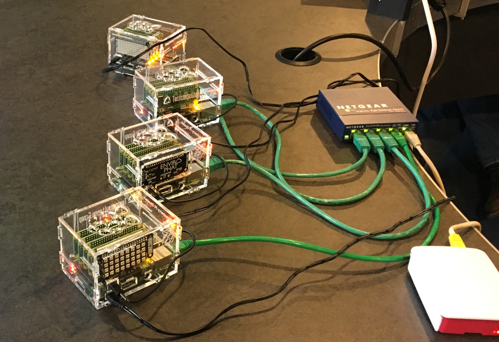

# Ansible Cluster
The Ansible Cluster, also known as the Blinkenlichts, are a set of Raspberry Pi Zeros (sixteen of them) mounted inside a plexiglas enclosure that also fits a 8086 ClusterHat and a Raspberry Pi 2b. 

## Technical description
The Zeros are connected with their USB busses to the 2b (that's where the ClusterHat and a short USB cable come in), which is connected to a network through ethernet. The Zero's USB ports are used as network ports and the Zeros boot over the network. The 2b provides a NAS for each of the four connected Zero's.

## What are the Blinkenlichts for
As they are, the Zeros provide a compact set of seperate Linux computers, named p11, p12, p13, p14, p21, p22 and so on. They can be used for all applications that require a compact Linux solution. In this case however, they are used as nodes for an Ansible training setup.
